## 🚨 Cloning or Forking this repo (must read!)

> "Plagiarism brings on bad karma and may lead to reincarnation as a bad piece of art or, worse, a bad politician" *Jacques Vesery*

If you found this project useful for you, please acknowledge the effort of the authors by **giving this repo a star**. The attribution of yours would help the open source community go a long way.

#### 1. Disclaimer: 

This project is solely created for academic purposes and do not represent those of my employer

#### 2. Important:

The **QR code generated** has to be scanned with the [Medicine QR code scanner](https://github.com/cyeehan/medicine-qr-code-scanner) for ideal outcome.

#### 3. Login credentials

| No. | ID                  | Password |
| --- | ------------------- | -------- |
| 1   | i18015334 (staff)   | 12345678 |
| 2   | i18016358 (student) | 123456   |

### System workflow

*(Solely focusing on **Medicine App**)*

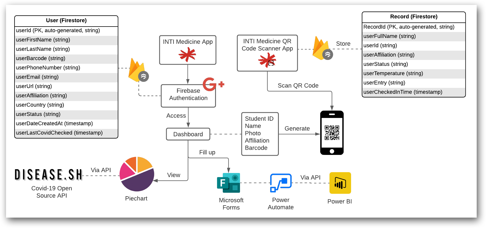

### Mobile screenshots

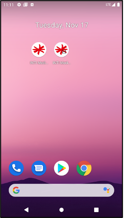

### Login page & Reset password

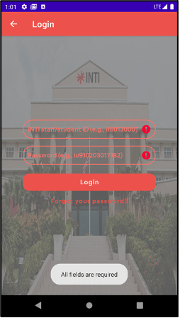
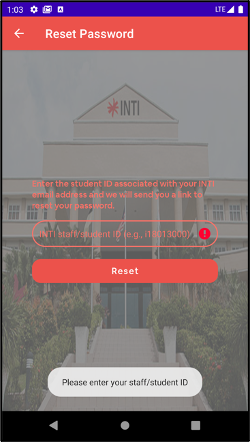

### Main home page

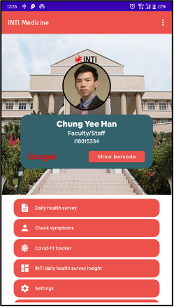
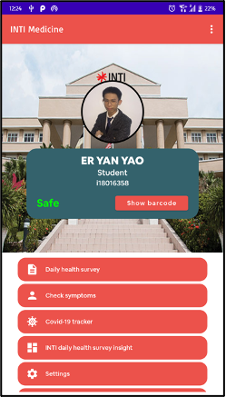

### QR code generator with personal details

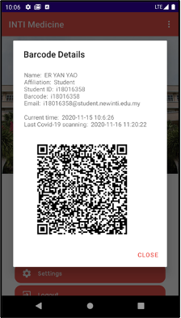
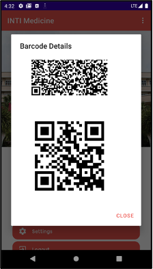

### Google Firestore

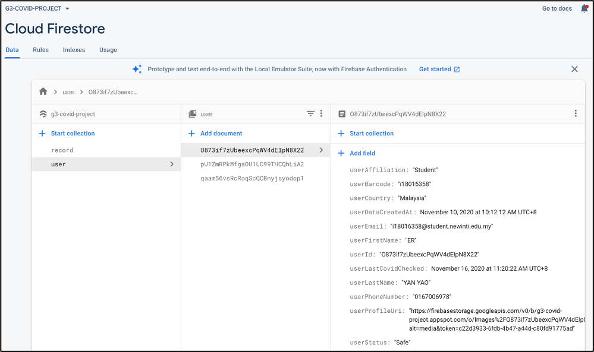

### Microsoft Forms (WebView feature)

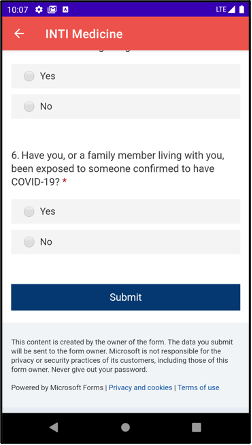

### Symptom checker

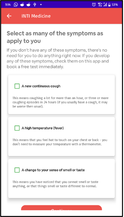
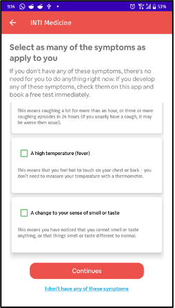
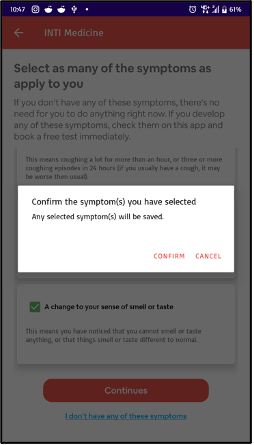
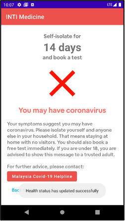
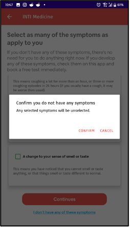
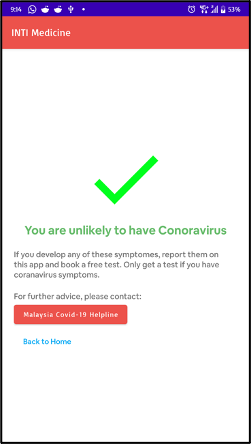

### Covid-19 Tracker

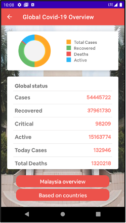
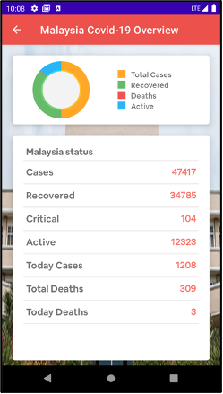
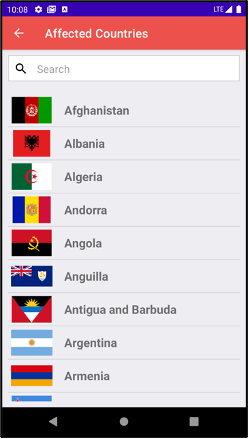
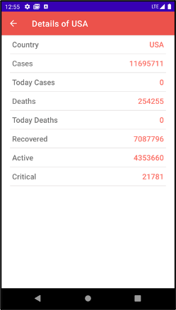

### Microsoft PowerBI

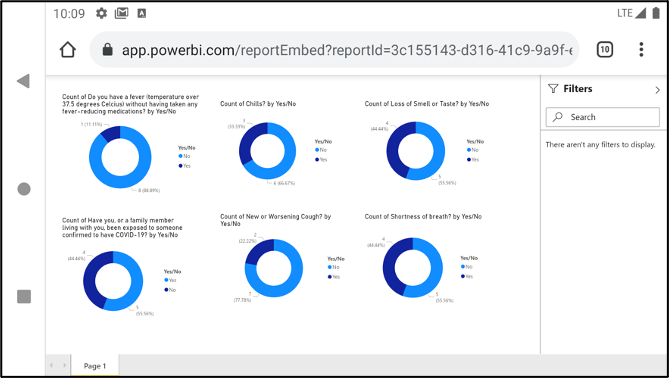

### Microsoft Power Automate

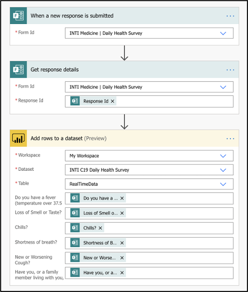

### Settings

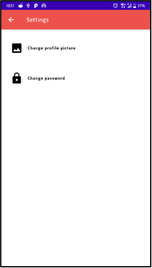

### Change profile picture

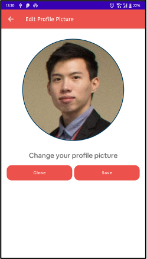
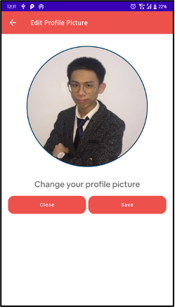

### Firebase storage

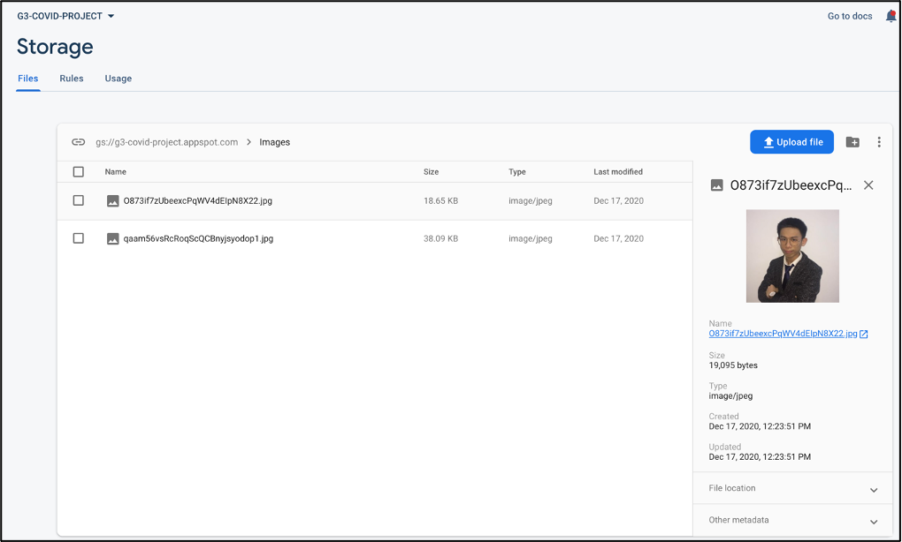

### Change password

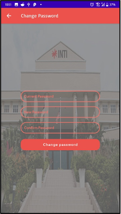

## Inspiration

1. https://uit.stanford.edu/news/access-stanford-health-check-tool-through-mobile-app
2. https://covid19.nhs.uk

## Acknowledgements

This is one of the projects built by Chung Yee Han, Er Yan Yao, and Low Yong Ting in November 2020 within 2 weeks for course subject **Mobile Application Development, PRG4201** by **Dr. Deshinta Arrova Dewi**.